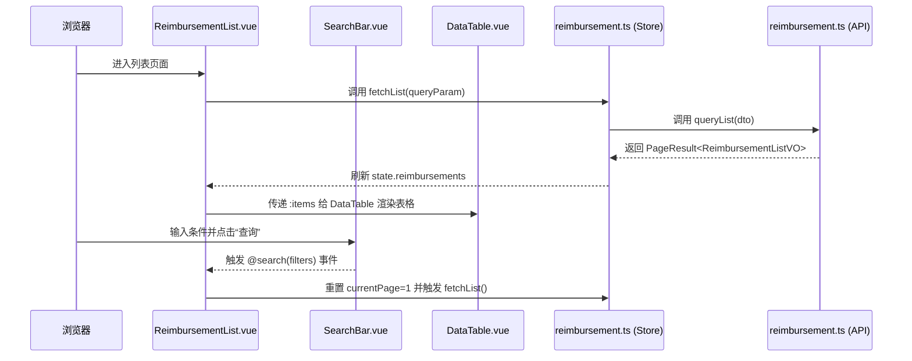
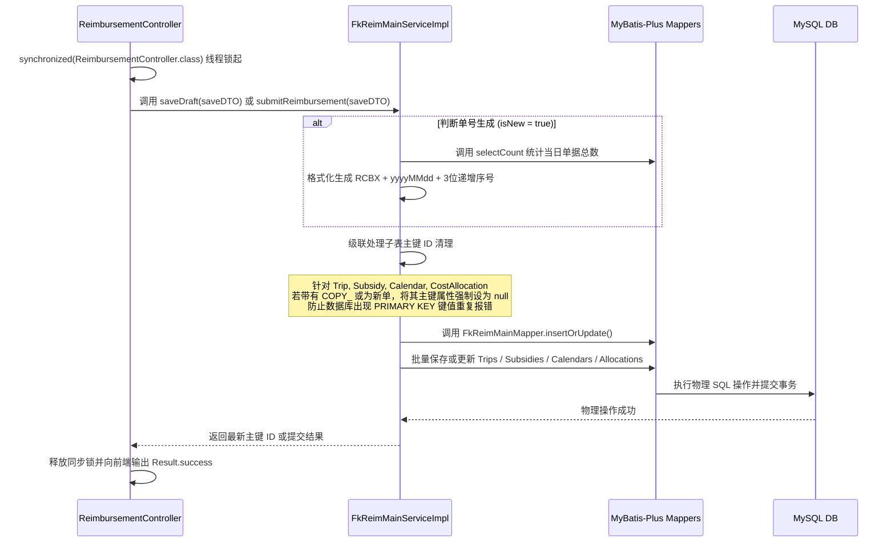

# 差旅报销管理系统 — 项目代码全景阅读与设计开发指南

---

## 📂 一、 项目结构与文件夹职责说明

本项目采用**前后端分离**架构，分为前端 `reimbursement-front` 与后端 `reimbursement-back` 两个子系统。以下是整体项目的目录结构及各文件夹的具体职责说明：

```
travel-reimbursement/
├── sql.txt                             # MySQL 数据库表结构及字典数据初始化脚本
├── start-all.bat                       # Windows 一键启动前后端脚本（双击运行）
├── start-all.sh                        # Linux/Git Bash 环境下一键启动脚本
├── README.md                           # 本项目架构及代码阅读指南
├── reimbursement-front/                 # 前端子系统（Vue 3 + TS + Vite）
│   ├── package.json                    # 前端依赖及编译构建指令配置文件
│   ├── vite.config.ts                  # Vite 配置文件（含开发期反向代理配置）
│   ├── index.html                      # 单页面应用（SPA）入口 HTML 模板
│   ├── tsconfig.json                   # TypeScript 配置文件
│   └── src/                            # 前端核心源码目录
│       ├── main.ts                     # 主入口文件，初始化 Vue 实例并挂载插件
│       ├── App.vue                     # 根组件，全局视图容器
│       ├── router/                     # 路由目录
│       │   └── index.ts                # 路由配置（定义列表页、详情页路径）
│       ├── api/                        # 接口通信层
│       │   ├── request.ts              # Axios 拦截器封装（基础 URL、响应封装拦截）
│       │   ├── baseData.ts             # 基础字典数据 HTTP 请求定义
│       │   └── reimbursement.ts        # 报销单增删改查 HTTP 请求定义
│       ├── stores/                     # 状态管理层（Pinia）
│       │   ├── baseData.ts             # 字典数据缓存仓库（只读数据本地化存储）
│       │   └── reimbursement.ts        # 报销单业务逻辑交互仓库
│       ├── utils/                      # 工具类目录
│       │   ├── formatter.ts            # 全局金额、日期格式化函数
│       │   ├── subsidyCalculator.ts    # 前端差旅补助、城市标准计算逻辑
│       │   └── validator.ts            # 表单提交强校验规则库
│       ├── views/                      # 页面视图组件
│       │   ├── ReimbursementList.vue   # 报销单主列表页面
│       │   └── ReimbursementDetail.vue # 报销单详情/编辑/只读查看三合一页面
│       └── components/                 # 局部/功能性组件
│           ├── SearchBar.vue           # 列表页查询过滤面板
│           ├── DataTable.vue           # 列表页展示表格（采用 Teleport 挂载下拉操作）
│           ├── Pagination.vue          # 表格底部分页控件
│           ├── ConfirmDialog.vue       # 统一样式的操作确认弹窗
│           ├── TreeSelect.vue          # 业务类型树形下拉选择组件
│           ├── common/                 # 全局复用通用组件
│           │   ├── FormField.vue       # 表单字段容器（带错误提示渲染）
│           │   └── SectionHeader.vue   # 详情页模块卡片折叠栏头部
│           └── detail/                 # 详情页垂直分块局部组件
│               ├── BasicInfoSection.vue# 基础信息填写模块
│               ├── TripSection.vue     # 行程补录表格模块
│               ├── TripDialog.vue      # 录入行程的弹窗表单
│               ├── SubsidyInfoSection.vue # 补助核算汇总模块
│               ├── SubsidyCalendarDialog.vue # 逐日勾选餐、路、通补助明细弹窗
│               ├── CostSummarySection.vue  # 金额大卡片展示模块
│               ├── CostAllocationSection.vue # 归属公司/项目比例分摊模块
│               ├── RemarkSection.vue   # 备注填写模块
│               └── ActionBar.vue       # 底部操作按钮栏
└── reimbursement-back/                  # 后端子系统（Spring Boot 3.x + MyBatis-Plus）
    ├── pom.xml                         # Maven 依赖关系与打包构建定义
    └── src/
        ├── main/
        │   ├── java/com/example/reimbursementback/
        │   │   ├── ReimbursementBackApplication.java # Spring Boot 主入口启动类
        │   │   ├── common/             # 公共组件层
        │   │   │   └── Result.java     # 统一 REST API JSON 格式包装对象
        │   │   ├── config/             # 系统配置层
        │   │   │   └── MyBatisPlusConfig.java # 分页插件拦截器配置
        │   │   ├── controller/         # 接口控制层（提供 HTTP 映射）
        │   │   │   ├── BaseDataController.java # 基础字典数据接口
        │   │   │   └── ReimbursementController.java # 报销单业务流程接口
        │   │   ├── service/            # 业务逻辑服务层（接口定义）
        │   │   │   ├── BaseDataService.java
        │   │   │   ├── FkReimCostAllocationService.java
        │   │   │   ├── FkReimMainService.java
        │   │   │   ├── FkReimSubsidyCalendarService.java
        │   │   │   ├── FkReimSubsidyService.java
        │   │   │   └── FkReimTripService.java
        │   │   │   └── impl/           # 业务逻辑具体实现类（核心所在）
        │   │   │       ├── BaseDataServiceImpl.java
        │   │   │       ├── FkReimCostAllocationServiceImpl.java
        │   │   │       ├── FkReimMainServiceImpl.java (主逻辑控制类)
        │   │   │       ├── FkReimSubsidyCalendarServiceImpl.java
        │   │   │       ├── FkReimSubsidyServiceImpl.java
        │   │   │       └── FkReimTripServiceImpl.java
        │   │   ├── mapper/             # 数据映射持久层（持久化接口，无冗余空 XML）
        │   │   │   ├── BaseBusinessTypeMapper.java
        │   │   │   ├── BaseCityMapper.java
        │   │   │   ├── BaseCompanyMapper.java
        │   │   │   ├── BaseDepartmentMapper.java
        │   │   │   ├── BaseEmployeeMapper.java
        │   │   │   ├── BaseProjectMapper.java
        │   │   │   ├── FkReimCostAllocationMapper.java
        │   │   │   ├── FkReimMainMapper.java
        │   │   │   ├── FkReimSubsidyCalendarMapper.java
        │   │   │   ├── FkReimSubsidyMapper.java
        │   │   │   └── FkReimTripMapper.java
        │   │   ├── entity/             # 实体层 POJO
        │   │   │   ├── base/           # 映射 base_ 字典表的实体类
        │   │   │   └── business/       # 映射 fk_ 业务表的实体类
        │   │   ├── dto/                # 前端入参数据传输对象
        │   │   │   ├── ReimbursementQueryDTO.java # 查询过滤条件 DTO
        │   │   │   └── ReimbursementSaveDTO.java  # 保存/提交大表单 DTO
        │   │   └── vo/                 # 后端向前端返回的数据对象
        │   │       ├── ReimbursementListVO.java   # 列表物理分页展示 VO
        │   │       └── ReimbursementDetailVO.java # 回显详情数据 VO
        │   └── resources/
        │       └── application.properties # 数据库连接及全局配置
        └── test/                       # 单元测试模块

```

---

## 🔄 二、 文件与组件核心交互逻辑

### 1. 列表页查询与操作交互流


### 2. 详情页表单联动与自动保存交互流
在报销单详情页 [ReimbursementDetail.vue](file:///d:/Desktop/java/travel-reimbursement/reimbursement-front/src/views/ReimbursementDetail.vue) 中，通过状态控制子模块的数据联动：
* **只读锁判定**：详情页初始化时，会计算 `isReadOnly`。若 URL 含有 `?mode=view`，或者数据库回显数据中 `status === 2`（已作废）或 `status === 1`（已完成），则强制判定 `isReadOnly = true`。此标识将流转至所有子表单，屏蔽全部编辑框并隐藏提交、保存、增删行按钮。
* **行程补录与补助自动生成联动**：
  * 当用户在 `TripSection.vue` 中补录完一条行程并确定后，触发事件 `@update-trips` 指向详情主页。
  * 详情主页在接收到最新行程数组后，自动调用 `subsidyCalculator.ts` 中 `getDatesBetween` 拆解行程日期段，按到达城市匹配补贴标准，为新增加的出行人自动计算并动态初始化一条 `SubsidyInfo`，并在其下生成按日分布的 `SubsidyCalendar` 列表（默认状态均为全勾选）。
  * 随后，自动触发 `reimbursementStore.saveDraft`，实时将此变动入库保存至后端（草稿状态 `status = 0`），保证用户录入的明细数据绝不丢失。
* **补助日历手填勾选与自动汇总联动**：
  * 在 `SubsidyInfoSection.vue` 中点击某行的 `✏️` 按钮，唤起 `SubsidyCalendarDialog.vue`。
  * 用户在弹窗内每勾选/取消勾选一次餐、路、通补助，或者手动调整实际补贴金额时，弹窗左侧的“补助总金额”面板均由计算属性进行实时汇总计算。
  * 点击确认后，该行程在主页面中的“申请金额”和“实际补助金额”将被更新，进而触发全局合计卡片 `CostSummarySection.vue` 内 `subsidyTotal`、`mealSubsidyTotal` 等金额卡片的刷新。
  * 确认操作同时也会联动触发后端保存草稿的接口，将最新的补助日历与汇总金额静默持久化至数据库。
* **费用分摊差值自动计算联动**：
  * 在 `CostAllocationSection.vue` 中，为了绝对确保财务总额的一致性，表格的首行（通常为差差旅表单对应归属公司的“主分摊行”）被强制设为 `:disabled="true"` 锁定只读。
  * 用户仅能在新增的其他分摊行上修改百分比比例（如 `20.00%`）或金额。首行的比例与金额会自动使用 `总比例(100.00%) - ∑(其他行比例)` 以及 `总补助额 - ∑(其他行金额)` 来动态实时计算。这防止了因为除数不能除尽（例如均摊 3 等份出现 33.33%）所导致的合计值与补助总额不相等的情况。
  * 修改完成后，同样触发 `@update-allocations` 事件并引发后端的实时保存草稿。

### 3. 表单强校验与提交流程
当用户点击底部操作栏 [ActionBar.vue](file:///d:/Desktop/java/travel-reimbursement/reimbursement-front/src/components/detail/ActionBar.vue) 的“确认提交”按钮时，触发以下过程：
1. `ReimbursementDetail.vue` 拦截点击，调用 [utils/validator.ts](file:///d:/Desktop/java/travel-reimbursement/reimbursement-front/src/utils/validator.ts) 中的 `validateReimbursement(model)` 函数进行强校验。
2. 校验内容包含：
   * 基础信息（标题、报销人、部门、公司、业务类型、出差事由）非空。
   * 行程补录中必须至少存在一条行程，且出行人、出发到达城市、出发到达日期完整。
   * **行程时间区间防重叠校验**：同一个出行人在不同的行程明细中，出差日期段不能交叉重合。
   * **财务分摊一致性校验**：所有分摊行（包含主分摊行）的比例之和必须精确等于 `100.00%`，分摊金额合计值必须精确等于主单的 `subsidyTotal`（允许五分钱以内的计算微调偏差）。
3. **未通过校验**：
   * 将 `validateReimbursement` 返回的 `errors` 键值对赋给页面响应式对象 `validationErrors`。
   * 页面定位出错的表单区域（如 `errors.title` 存在，则强行将 `collapsedStates.basicInfo` 设置为 `false` 自动展开折叠卡片）。
   * 弹出二次确认弹窗并红字标出错误原因，提示用户修改。
4. **通过校验**：
   * 调用 `reimbursementStore.submitSheet(model)` 接口。
   * 发起 HTTP POST 请求，将单据状态置为 `1`（已完成）。
   * 弹出“提交成功”弹窗，点击后跳转回列表页，页面重新触发物理分页列表加载。

### 4. 后端保存与提交流


---

## 🌐 三、 前后端数据接口 (API) 定义

所有的 HTTP 请求均由前端通过代理中继发送至后端：
* 前端 API 基准路径：`/api`（开发环境下被 Vite 代理拦截，重写为 `/` 后转发）
* 后端服务接收端口：`http://localhost:8080`

### 1. 基础字典数据接口

#### 1.1 获取费用归属公司列表
* **请求方式**：`GET`
* **请求路径**：`/base_data/companies`
* **请求参数**：无
* **响应数据 (JSON)**：
```json
{
  "code": 200,
  "msg": "success",
  "data": [
    {
      "id": "1",
      "companyNo": "C001",
      "name": "胜意科技杭州分公司"
    }
  ]
}
```

#### 1.2 获取部门列表
* **请求方式**：`GET`
* **请求路径**：`/base_data/departments`
* **响应数据 (JSON)**：
```json
{
  "code": 200,
  "msg": "success",
  "data": [
    {
      "id": "1",
      "no": "072001",
      "name": "客户成功事业部"
    }
  ]
}
```

#### 1.3 获取员工列表
* **请求方式**：`GET`
* **请求路径**：`/base_data/employees`
* **响应数据 (JSON)**：
```json
{
  "code": 200,
  "msg": "success",
  "data": [
    {
      "id": "1",
      "no": "74541",
      "name": "徐年年"
    }
  ]
}
```

#### 1.4 获取业务类型树（含层级嵌套）
* **请求方式**：`GET`
* **请求路径**：`/base_data/businessTypes`
* **响应数据 (JSON)**：
```json
{
  "code": 200,
  "msg": "success",
  "data": [
    {
      "id": "1",
      "businessTypeNo": "BT_01",
      "name": "行政报销",
      "thereSubordinateNode": "1",
      "superiorId": "none",
      "children": [
        {
          "id": "2",
          "businessTypeNo": "BT_01_01",
          "name": "个人团队培训",
          "thereSubordinateNode": "0",
          "superiorId": "1",
          "children": null
        }
      ]
    }
  ]
}
```

#### 1.5 获取城市列表及其补助分级
* **请求方式**：`GET`
* **请求路径**：`/base_data/cities`
* **响应数据 (JSON)**：
```json
{
  "code": 200,
  "msg": "success",
  "data": [
    {
      "cityNo": "HGH",
      "name": "杭州",
      "cityType": "2" // 1一线 2二线 3三线
    }
  ]
}
```

#### 1.6 获取项目列表
* **请求方式**：`GET`
* **请求路径**：`/base_data/projects`
* **响应数据 (JSON)**：
```json
{
  "code": 200,
  "msg": "success",
  "data": [
    {
      "id": "1",
      "projectNo": "P001",
      "name": "报销管理系统研发"
    }
  ]
}
```

---

### 2. 报销单核心业务接口

#### 2.1 报销单分页搜索列表
* **请求方式**：`GET`
* **请求路径**：`/reimbursement/list`
* **请求参数 (Query Params)**：
  * `reimNo`: String（单号，模糊匹配，选填）
  * `title`: String（标题，模糊匹配，选填）
  * `reason`: String（事由，模糊匹配，选填）
  * `companyId`: String（归属公司 ID，精确匹配，选填）
  * `deptId`: String（部门 ID，精确匹配，选填）
  * `reimburserId`: String（报销人 ID，精确匹配，选填）
  * `businessTypeId`: String（业务类型 ID，精确匹配，选填）
  * `pageNum`: Integer（当前页码，必填）
  * `pageSize`: Integer（每页记录数，必填）
* **响应数据 (JSON)**：
```json
{
  "code": 200,
  "msg": "success",
  "data": {
    "records": [
      {
        "id": "1234567890",
        "reimNo": "RCBX20260701001",
        "status": 0, // 0草稿 1已完成 2已作废
        "reimburserId": "1",
        "reimburserName": "徐年年",
        "reimburserNo": "74541",
        "reimDepartmentId": "1",
        "reimDepartmentName": "客户成功事业部",
        "reimDepartmentNo": "072001",
        "reimCompanyId": "1",
        "reimCompanyName": "胜意科技杭州分公司",
        "reimCompanyNo": "C001",
        "businessTypeId": "2",
        "businessTypeName": "个人团队培训",
        "businessTypeNo": "BT_01_01",
        "title": "杭州培训出差报销",
        "reason": "参加总部技术内训",
        "subsidyTotal": 320.00,
        "createTime": "2026-07-01T10:00:00"
      }
    ],
    "total": 1,
    "size": 10,
    "current": 1,
    "pages": 1
  }
}
```

#### 2.2 获取报销单全量回显明细
* **请求方式**：`GET`
* **请求路径**：`/reimbursement/detail/{id}`
* **路由参数**：`id` (报销单主表主键 ID)
* **响应数据 (JSON)**：包含主表及四大子表明细，供详情页回显全量数据。

#### 2.3 保存报销单草稿（强并发锁控制）
* **请求方式**：`POST`
* **请求路径**：`/reimbursement/save`
* **请求体 (RequestBody - JSON)**：数据结构包含主表数据及行程、补助、日历、分摊四大子表数组集合。
* **响应数据 (JSON)**：
```json
{
  "code": 200,
  "msg": "success",
  "data": "1234567890" // 返回数据库中真实落库的报销单主键 ID
}
```

#### 2.4 确认提交报销单（强校验与状态变更）
* **请求方式**：`POST`
* **请求路径**：`/reimbursement/submit`
* **请求体 (RequestBody - JSON)**：结构与保存草稿接口相同。
* **响应数据 (JSON)**：
```json
{
  "code": 200,
  "msg": "success",
  "data": null
}
```

#### 2.5 物理删除报销单
* **请求方式**：`DELETE`
* **请求路径**：`/reimbursement/delete/{id}`
* **路由参数**：`id` (主单 ID)
* **响应数据 (JSON)**：
```json
{
  "code": 200,
  "msg": "success",
  "data": null
}
```

#### 2.6 作废已完成/草稿单据（更新状态为 2）
* **请求方式**：`PUT`
* **请求路径**：`/reimbursement/cancel/{id}`
* **路由参数**：`id` (主单 ID)
* **响应数据 (JSON)**：
```json
{
  "code": 200,
  "msg": "success",
  "data": null
}
```
