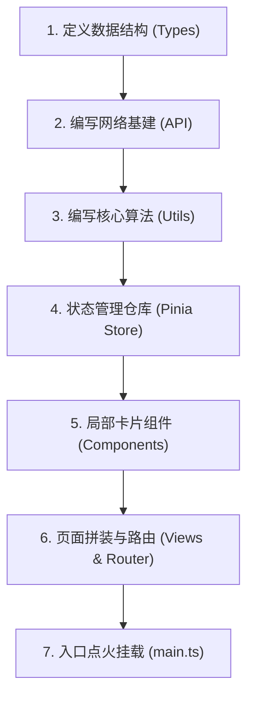

# 前端项目开发顺序指南（以差旅报销系统为例）

本指南整理了在实际商业项目开发中，前端开发人员编写 `src` 目录代码的科学逻辑顺序。遵循**“自底向上，数据先行”**的原则，能极大提高开发效率，减少代码返工。

---

## 🚀 核心开发步骤全景

---

## 📝 详细开发阶段拆解

### 第一步：定义数据结构（TypeScript 类型）—— 明确“规矩”
开发任何页面或业务前，首先要明确数据的结构和长相。
* **文件路径**：`src/types/index.ts`
* **开发内容**：在此处定义主单 `Reimbursement`、行程 `Trip`、补助明细 `SubsidyInfo` 等 TS 接口。
* **设计意图**：只有先定好这些类型，后续在编写 API、Store 以及组件的数据绑定时，IDE 才会提供精准的代码自动补全和静态类型校验。

---

### 第二步：网络基建与 API 接口层 —— 建立“数据通道”
网络通道是前端与后端沟通的桥梁。
1. **网络请求客户端**：`src/api/request.ts` (封装 Axios，设置全局拦截器、请求头、跨域代理)。
2. **业务请求定义**：`src/api/baseData.ts` (获取下拉字典项数据接口) 和 `reimbursement.ts` (报销单增删改查 HTTP 接口)。
* **设计意图**：由于第一步的类型已定义完毕，此处的接口函数可以直接指定强类型入参（如 `ReimbursementSaveDTO`）和出参，保证接口数据规范。

---

### 第三步：工具类与核心算法（Utils）—— 编写“纯算法大脑”
脱离界面，率先把最核心的数学计算和数据校验逻辑写完。
* **文件路径**：
  * `src/utils/subsidyCalculator.ts`：计算出差天数、匹配一线/二线城市不同补贴标准的核心公式。
  * `src/utils/validator.ts`：表单强校验逻辑（分摊比例之和必为100%、金额必等总补助等）。
* **设计意图**：这些属于“纯函数（Pure Functions）”，不依赖任何 DOM 节点或 UI 状态，极易编写并进行单元测试（Unit Test），确保计算百分之百准确。

---

### 第四步：状态管理层（Pinia Store）—— 准备“全局数据中心”
在画页面前，必须准备好数据的存放与流转中心。
1. **基础数据缓存**：`src/stores/baseData.ts` (拉取并本地缓存公司、部门、员工等下拉框字典数据)。
2. **业务状态控制**：`src/stores/reimbursement.ts` (管理当前正在编辑的报销单状态，调度 API 接口)。
* **设计意图**：后面编写表单组件时，下拉框的数据源直接通过 `useBaseDataStore()` 调取，所以 Store 需要先行就绪。

---

### 第五步：组件层（Components）—— 拼装“局部积木”
开始画 UI 界面，遵循从细粒度通用组件到局部业务组件的顺序。
1. **全局复用组件**：`components/common/FormField.vue` (输入框红字报错包裹)、`SectionHeader.vue` (卡片折叠栏头部)。
2. **功能组件**：`components/DataTable.vue` (列表展示表格，采用 Teleport 挂载下拉操作)。
3. **详情页局部组件**：`components/detail/` 下的各个子卡片（基础信息表单、行程录入、日历勾选、费用分摊等）。
* **设计意图**：这些子卡片要双向绑定第一步定义的 `model` 数据，且需要读取第四步的 `baseDataStore`，此时它们所需的依赖已百分之百就绪。

---

### 第六步：页面级组件与路由（Views & Router）—— “总装配线”
将积木拼成完整的页面，并分配路由路径。
1. **列表主页拼装**：`src/views/ReimbursementList.vue`（将 SearchBar、DataTable、Pagination 组装在一起）。
2. **编辑主页拼装**：`src/views/ReimbursementDetail.vue`（将基础信息、行程、分摊等局部组件拼装起来，并绑定自动保存与强校验提交）。
3. **路由分发**：`src/router/index.ts`（为列表页和详情页配置 URL 访问路径）。

---

### 第七步：入口挂载（App.vue & main.ts）—— “点火启动”
* **文件路径**：`src/main.ts` 与 `src/App.vue`
* **开发内容**：在 `main.ts` 中注册 Pinia 状态库、Vue Router，并挂载到根组件 `App.vue` 上。打开浏览器访问 `http://localhost:5173` 开始真机联调。

---

## 💡 总结与建议

标准的开发顺序是：
**类型 (Types) ➜ 接口 (API) ➜ 算法 (Utils) ➜ 状态仓库 (Store) ➜ 积木组件 (Components) ➜ 页面装配 (Views) ➜ 路由挂载 (Router)**

* **核心优势**：每一步都建立在已有步骤的输出之上，绝不会出现“写组件时发现数据类型没定，或者发请求时发现没有接口函数”的情况。开发逻辑极为流畅，最适合敏捷迭代和团队规范化协作。
