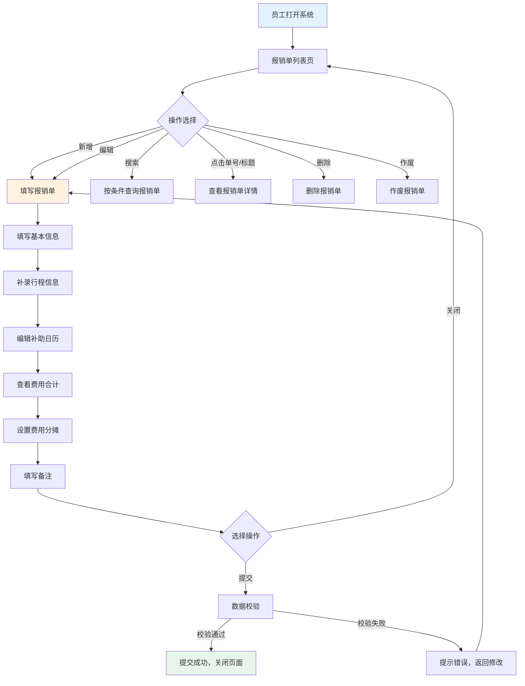
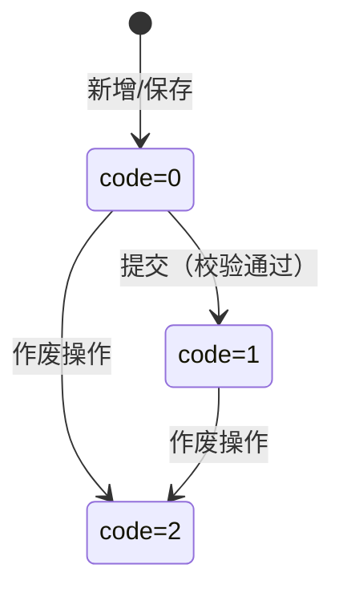
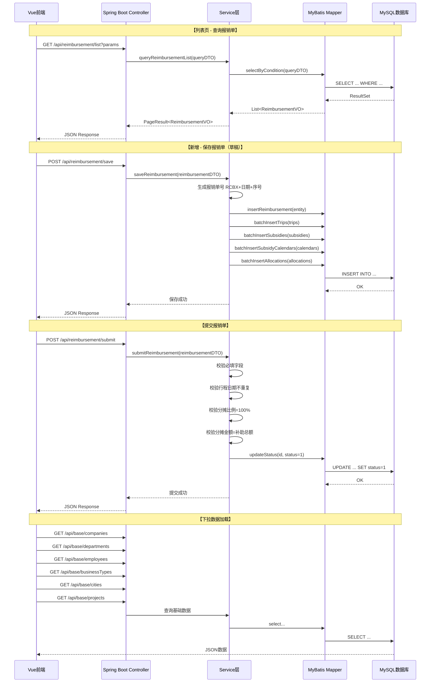
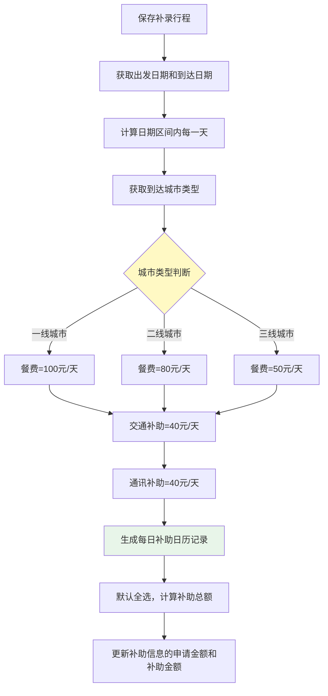
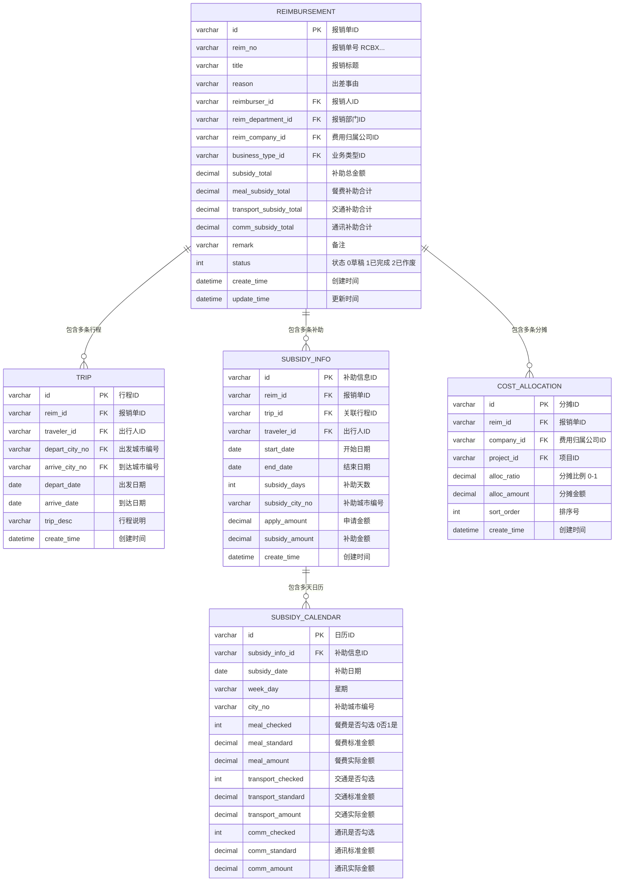
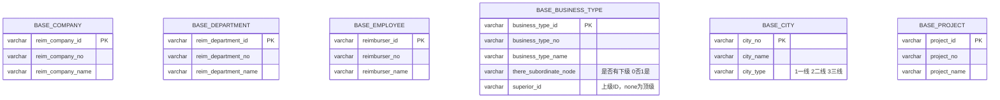
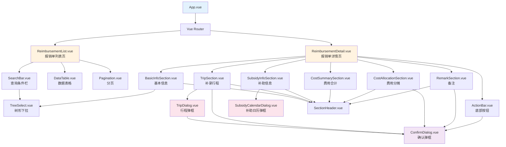

# 差旅报销系统 — 业务流程与代码框架设计

---

## 一、业务背景

员工因公出差后，需要与企业进行费用报销结算。本系统是一个**差旅费用报销管理系统**，核心解决以下问题：
- 员工垫付差旅费用后的报账结算
- 差旅补助（餐费、交通、通讯）的自动计算与管理
- 费用分摊到不同公司/项目的管理
- 报销单据的生命周期管理（草稿 → 已完成 → 已作废）

---

## 二、实际业务场景流程

### 2.1 差旅费用报销完整流程图（来自设计文档）


### 2.2 本练习项目简化的业务流程

> [!NOTE]
> 本项目为学生练习项目，不包含登录、审批流、财务结算等环节，聚焦于**报销单的填报与提交**。



### 2.3 业务流程详细步骤说明

| 步骤 | 操作 | 说明 |
|------|------|------|
| 1 | 进入列表页 | 查看已有报销单，支持多条件搜索 |
| 2 | 新增报销单 | 跳转至报销单编辑页面 |
| 3 | 填写基本信息 | 报销标题、事由、报销人、部门、归属公司、业务类型 |
| 4 | 补录行程 | 弹框录入出行人、出发/到达城市、日期、行程说明 |
| 5 | 编辑补助信息 | 根据行程自动生成补助日历，按天勾选餐费/交通/通讯补助 |
| 6 | 费用合计 | 自动汇总补助总金额、餐费、交通、通讯补助 |
| 7 | 费用分摊 | 将费用按比例分摊到不同公司/项目 |
| 8 | 填写备注 | 可选，最多1000字 |
| 9 | 提交 | 全量校验后提交，状态变为"已完成" |

### 2.4 单据状态流转



---

## 三、代码实现的具体流程

### 3.1 前后端交互流程



### 3.2 补助计算业务逻辑流程



---

## 四、数据库设计（ER图）



### 基础数据表（已提供静态数据，可直接用JSON或建表）



---

## 五、后端代码框架图（Spring Boot）

### 5.1 项目目录结构

```
reimbursement-backend/
├── pom.xml
├── src/
│   └── main/
│       ├── java/
│       │   └── com/
│       │       └── example/
│       │           └── reimbursement/
│       │               ├── ReimbursementApplication.java          ← Spring Boot 启动类
│       │               │
│       │               ├── config/                                ← 配置层
│       │               │   ├── CorsConfig.java                    ← 跨域配置
│       │               │   └── MyBatisPlusConfig.java             ← MyBatis-Plus 分页插件配置
│       │               │
│       │               ├── common/                                ← 公共模块
│       │               │   ├── Result.java                        ← 统一响应封装 {code, msg, data}
│       │               │   ├── PageResult.java                    ← 分页响应封装 {total, list}
│       │               │   └── BusinessException.java             ← 自定义业务异常
│       │               │
│       │               ├── controller/                            ← 控制器层
│       │               │   ├── ReimbursementController.java       ← 报销单CRUD接口
│       │               │   └── BaseDataController.java            ← 基础数据接口（下拉选项）
│       │               │
│       │               ├── service/                               ← 服务接口层
│       │               │   ├── ReimbursementService.java          ← 报销单业务接口
│       │               │   ├── TripService.java                   ← 行程业务接口
│       │               │   ├── SubsidyInfoService.java            ← 补助信息业务接口
│       │               │   ├── SubsidyCalendarService.java        ← 补助日历业务接口
│       │               │   ├── CostAllocationService.java         ← 费用分摊业务接口
│       │               │   └── BaseDataService.java               ← 基础数据业务接口
│       │               │
│       │               ├── service/impl/                          ← 服务实现层
│       │               │   ├── ReimbursementServiceImpl.java      ← 报销单业务实现
│       │               │   ├── TripServiceImpl.java               ← 行程业务实现
│       │               │   ├── SubsidyInfoServiceImpl.java        ← 补助信息业务实现
│       │               │   ├── SubsidyCalendarServiceImpl.java    ← 补助日历业务实现
│       │               │   ├── CostAllocationServiceImpl.java     ← 费用分摊业务实现
│       │               │   └── BaseDataServiceImpl.java           ← 基础数据业务实现
│       │               │
│       │               ├── mapper/                                ← MyBatis Mapper层
│       │               │   ├── ReimbursementMapper.java           ← 报销单Mapper
│       │               │   ├── TripMapper.java                    ← 行程Mapper
│       │               │   ├── SubsidyInfoMapper.java             ← 补助信息Mapper
│       │               │   ├── SubsidyCalendarMapper.java         ← 补助日历Mapper
│       │               │   ├── CostAllocationMapper.java          ← 费用分摊Mapper
│       │               │   ├── CompanyMapper.java                 ← 公司Mapper
│       │               │   ├── DepartmentMapper.java              ← 部门Mapper
│       │               │   ├── EmployeeMapper.java                ← 员工Mapper
│       │               │   ├── BusinessTypeMapper.java            ← 业务类型Mapper
│       │               │   ├── CityMapper.java                    ← 城市Mapper
│       │               │   └── ProjectMapper.java                 ← 项目Mapper
│       │               │
│       │               ├── entity/                                ← 数据库实体层
│       │               │   ├── Reimbursement.java                 ← 报销单实体
│       │               │   ├── Trip.java                          ← 行程实体
│       │               │   ├── SubsidyInfo.java                   ← 补助信息实体
│       │               │   ├── SubsidyCalendar.java               ← 补助日历实体
│       │               │   ├── CostAllocation.java                ← 费用分摊实体
│       │               │   ├── Company.java                       ← 公司实体
│       │               │   ├── Department.java                    ← 部门实体
│       │               │   ├── Employee.java                      ← 员工实体
│       │               │   ├── BusinessType.java                  ← 业务类型实体
│       │               │   ├── City.java                          ← 城市实体
│       │               │   └── Project.java                       ← 项目实体
│       │               │
│       │               ├── dto/                                   ← 数据传输对象层
│       │               │   ├── ReimbursementQueryDTO.java         ← 列表查询条件DTO
│       │               │   ├── ReimbursementSaveDTO.java          ← 报销单保存/提交DTO
│       │               │   ├── TripDTO.java                       ← 行程DTO
│       │               │   ├── SubsidyInfoDTO.java                ← 补助信息DTO
│       │               │   ├── SubsidyCalendarDTO.java            ← 补助日历DTO
│       │               │   └── CostAllocationDTO.java             ← 费用分摊DTO
│       │               │
│       │               └── vo/                                    ← 视图对象层
│       │                   ├── ReimbursementListVO.java            ← 列表展示VO
│       │                   ├── ReimbursementDetailVO.java          ← 详情展示VO
│       │                   ├── TripVO.java                         ← 行程展示VO
│       │                   ├── SubsidyInfoVO.java                  ← 补助信息展示VO
│       │                   ├── SubsidyCalendarVO.java              ← 补助日历展示VO
│       │                   └── CostAllocationVO.java               ← 费用分摊展示VO
│       │
│       └── resources/
│           ├── application.yml                                     ← 主配置文件
│           ├── mapper/                                             ← MyBatis XML映射
│           │   ├── ReimbursementMapper.xml
│           │   ├── TripMapper.xml
│           │   ├── SubsidyInfoMapper.xml
│           │   ├── SubsidyCalendarMapper.xml
│           │   ├── CostAllocationMapper.xml
│           │   ├── CompanyMapper.xml
│           │   ├── DepartmentMapper.xml
│           │   ├── EmployeeMapper.xml
│           │   ├── BusinessTypeMapper.xml
│           │   ├── CityMapper.xml
│           │   └── ProjectMapper.xml
│           └── sql/
│               └── init.sql                                        ← 数据库初始化脚本
```

### 5.2 每个Java类的职责说明

#### 启动类

| 类名 | 职责 |
|------|------|
| `ReimbursementApplication.java` | Spring Boot 启动入口，`@SpringBootApplication` |

#### config 包 — 配置类

| 类名 | 职责 |
|------|------|
| `CorsConfig.java` | 配置跨域，允许前端 `localhost:5173` 访问后端 |
| `MyBatisPlusConfig.java` | 配置 MyBatis-Plus 分页插件 `PaginationInterceptor` |

#### common 包 — 公共类

| 类名 | 职责 |
|------|------|
| `Result<T>` | 统一API响应格式：`{code: 200, msg: "success", data: T}` |
| `PageResult<T>` | 分页响应：`{total: long, list: List<T>}` |
| `BusinessException` | 自定义业务异常，用于校验失败时抛出 |

#### controller 包 — 控制器类

| 类名 | 核心方法 | 说明 |
|------|----------|------|
| `ReimbursementController` | `list()` | GET 分页查询报销单列表 |
|  | `detail(id)` | GET 获取报销单详情（含行程/补助/分摊） |
|  | `save(dto)` | POST 保存报销单（草稿） |
|  | `submit(dto)` | POST 提交报销单（含校验） |
|  | `delete(id)` | DELETE 删除报销单 |
|  | `cancel(id)` | PUT 作废报销单 |
| `BaseDataController` | `getCompanies()` | GET 获取公司列表 |
|  | `getDepartments()` | GET 获取部门列表 |
|  | `getEmployees()` | GET 获取员工列表 |
|  | `getBusinessTypes()` | GET 获取业务类型树 |
|  | `getCities()` | GET 获取城市列表 |
|  | `getProjects()` | GET 获取项目列表 |

#### service 包 — 服务接口

| 接口名 | 核心方法 | 说明 |
|--------|----------|------|
| `ReimbursementService` | `queryList(queryDTO)` | 条件分页查询 |
|  | `getDetail(id)` | 获取完整详情 |
|  | `save(saveDTO)` | 保存草稿 |
|  | `submit(saveDTO)` | 校验+提交 |
|  | `delete(id)` | 删除报销单及关联数据 |
|  | `cancel(id)` | 作废报销单 |
| `TripService` | `saveTrip(tripDTO)` | 保存行程 |
|  | `deleteTrip(id)` | 删除行程 |
|  | `getByReimId(reimId)` | 查询报销单下所有行程 |
|  | `checkDuplicateDate(...)` | 校验人员+日期是否重复 |
| `SubsidyInfoService` | `generateFromTrip(trip)` | 根据行程自动生成补助信息 |
|  | `getByReimId(reimId)` | 查询报销单下所有补助信息 |
|  | `updateSubsidyAmount(...)` | 更新补助金额 |
| `SubsidyCalendarService` | `generateCalendar(subsidyInfo, city)` | 根据日期区间+城市生成日历 |
|  | `updateCalendar(calendarDTO)` | 更新日历勾选和金额 |
|  | `getBySubsidyInfoId(id)` | 查询补助日历 |
| `CostAllocationService` | `saveAllocations(reimId, list)` | 保存分摊数据 |
|  | `getByReimId(reimId)` | 查询分摊数据 |
|  | `validateAllocation(...)` | 校验分摊比例=100%、金额=总额 |
| `BaseDataService` | `getAllCompanies()` | 查询所有公司 |
|  | `getAllDepartments()` | 查询所有部门 |
|  | `getAllEmployees()` | 查询所有员工 |
|  | `getBusinessTypeTree()` | 查询业务类型并组装树结构 |
|  | `getAllCities()` | 查询所有城市 |
|  | `getAllProjects()` | 查询所有项目 |

#### service/impl 包 — 服务实现类

| 实现类 | 关键业务逻辑 |
|--------|-------------|
| `ReimbursementServiceImpl` | 生成单号（RCBX+年月日+序号）、组装详情数据、提交校验逻辑 |
| `TripServiceImpl` | 人员+日期范围重复校验、保存行程时联动生成补助信息 |
| `SubsidyInfoServiceImpl` | 根据行程生成补助数据，汇总补助金额 |
| `SubsidyCalendarServiceImpl` | 按天生成日历、根据城市类型设置标准金额、计算星期数 |
| `CostAllocationServiceImpl` | 均摊计算、余数处理（差值放首行）、比例校验 |
| `BaseDataServiceImpl` | 查询基础数据，业务类型递归组装树结构 |

#### entity 包 — 数据库实体

| 实体类 | 对应表 | 说明 |
|--------|--------|------|
| `Reimbursement` | reimbursement | 报销单主表 |
| `Trip` | trip | 行程表 |
| `SubsidyInfo` | subsidy_info | 补助信息表 |
| `SubsidyCalendar` | subsidy_calendar | 补助日历表 |
| `CostAllocation` | cost_allocation | 费用分摊表 |
| `Company` | base_company | 公司基础数据 |
| `Department` | base_department | 部门基础数据 |
| `Employee` | base_employee | 员工基础数据 |
| `BusinessType` | base_business_type | 业务类型基础数据 |
| `City` | base_city | 城市基础数据 |
| `Project` | base_project | 项目基础数据 |

#### dto 包 — 数据传输对象

| DTO类 | 用途 |
|-------|------|
| `ReimbursementQueryDTO` | 列表查询参数：单号、标题、事由、公司ID、部门ID、报销人ID、业务类型ID、分页参数 |
| `ReimbursementSaveDTO` | 保存/提交：包含基本信息 + List\<TripDTO\> + List\<CostAllocationDTO\> + 备注 |
| `TripDTO` | 行程数据：出行人、出发/到达城市、出发/到达日期、行程说明 |
| `SubsidyInfoDTO` | 补助信息：补助天数、补助城市、申请金额、补助金额 |
| `SubsidyCalendarDTO` | 补助日历：日期、城市、三项补助的勾选状态和金额 |
| `CostAllocationDTO` | 分摊数据：费用归属公司、项目、分摊比例、分摊金额 |

#### vo 包 — 视图对象

| VO类 | 用途 |
|------|------|
| `ReimbursementListVO` | 列表展示：单号、状态、报销人(姓名+工号)、部门(名称+编号)、公司、业务类型、标题、事由、补助金额、创建时间 |
| `ReimbursementDetailVO` | 详情展示：主单信息 + List\<TripVO\> + List\<SubsidyInfoVO\> + 费用合计 + List\<CostAllocationVO\> + 备注 |
| `TripVO` | 行程展示：出行人员(姓名/工号)、出差日期范围、行程(出发-到达城市)、行程说明 |
| `SubsidyInfoVO` | 补助展示：出行人、出差日期、补助天数、行程、补助城市、申请金额、补助金额 |
| `SubsidyCalendarVO` | 日历展示：日期、星期、城市、三项补助的标准/实际金额和勾选状态 |
| `CostAllocationVO` | 分摊展示：序号、费用归属(公司名)、项目名、分摊比例(百分比)、分摊金额 |

#### mapper 包 — 数据访问层

| Mapper接口 | 核心方法 |
|-----------|---------|
| `ReimbursementMapper` | `selectByCondition(queryDTO)` / `insert()` / `updateById()` / `deleteById()` |
| `TripMapper` | `insertBatch(list)` / `selectByReimId(reimId)` / `deleteById()` / `checkDuplicate(...)` |
| `SubsidyInfoMapper` | `insertBatch(list)` / `selectByReimId(reimId)` / `deleteByTripId()` |
| `SubsidyCalendarMapper` | `insertBatch(list)` / `selectBySubsidyInfoId(id)` / `updateBatch(list)` |
| `CostAllocationMapper` | `insertBatch(list)` / `selectByReimId(reimId)` / `deleteByReimId()` |
| `CompanyMapper` | `selectAll()` |
| `DepartmentMapper` | `selectAll()` |
| `EmployeeMapper` | `selectAll()` |
| `BusinessTypeMapper` | `selectAll()` |
| `CityMapper` | `selectAll()` / `selectByCityNo(cityNo)` |
| `ProjectMapper` | `selectAll()` |

---

## 六、前端代码框架图（Vue 3 + Vite）

### 6.1 项目目录结构

```
reimbursement-front/
├── index.html
├── vite.config.ts
├── package.json
├── src/
│   ├── main.ts                                    ← 应用入口
│   ├── App.vue                                    ← 根组件
│   │
│   ├── router/                                    ← 路由配置
│   │   └── index.ts                               ← 定义列表页和详情页路由
│   │
│   ├── stores/                                    ← Pinia状态管理
│   │   ├── reimbursement.ts                       ← 报销单状态管理
│   │   └── baseData.ts                            ← 基础数据状态管理
│   │
│   ├── api/                                       ← API请求封装
│   │   ├── request.ts                             ← Axios实例封装（baseURL, 拦截器）
│   │   ├── reimbursement.ts                       ← 报销单API（增删改查提交）
│   │   └── baseData.ts                            ← 基础数据API（公司/部门/员工/...）
│   │
│   ├── views/                                     ← 页面组件
│   │   ├── ReimbursementList.vue                  ← 报销单列表页
│   │   └── ReimbursementDetail.vue                ← 报销单详情/编辑页
│   │
│   ├── components/                                ← 通用/业务组件
│   │   ├── SearchBar.vue                          ← 列表页查询条件栏
│   │   ├── DataTable.vue                          ← 通用数据表格
│   │   ├── Pagination.vue                         ← 分页组件
│   │   ├── ConfirmDialog.vue                      ← 确认弹框组件
│   │   ├── TreeSelect.vue                         ← 树形下拉选择（业务类型）
│   │   │
│   │   ├── detail/                                ← 详情页子组件
│   │   │   ├── BasicInfoSection.vue               ← 基本信息分区（可折叠）
│   │   │   ├── TripSection.vue                    ← 补录行程分区
│   │   │   ├── TripDialog.vue                     ← 补录行程弹框
│   │   │   ├── SubsidyInfoSection.vue             ← 补助信息分区
│   │   │   ├── SubsidyCalendarDialog.vue          ← 补助日历弹框
│   │   │   ├── CostSummarySection.vue             ← 费用合计分区
│   │   │   ├── CostAllocationSection.vue          ← 费用归属及分摊分区
│   │   │   ├── RemarkSection.vue                  ← 备注信息分区
│   │   │   └── ActionBar.vue                      ← 底部按钮栏（关闭/提交）
│   │   │
│   │   └── common/                                ← 通用UI组件
│   │       ├── SectionHeader.vue                  ← 分区头部（含折叠箭头）
│   │       └── FormField.vue                      ← 表单字段封装
│   │
│   ├── utils/                                     ← 工具函数
│   │   ├── validator.ts                           ← 前端校验工具
│   │   ├── formatter.ts                           ← 格式化工具（日期、金额、百分比）
│   │   └── subsidyCalculator.ts                   ← 补助计算工具（城市类型→标准金额）
│   │
│   ├── types/                                     ← TypeScript类型定义
│   │   ├── reimbursement.ts                       ← 报销单相关类型
│   │   ├── trip.ts                                ← 行程相关类型
│   │   ├── subsidy.ts                             ← 补助相关类型
│   │   ├── allocation.ts                          ← 分摊相关类型
│   │   └── baseData.ts                            ← 基础数据类型
│   │
│   └── assets/                                    ← 静态资源
│       └── styles/
│           ├── main.css                           ← 全局样式
│           ├── variables.css                      ← CSS变量（颜色/字号/间距）
│           └── components.css                     ← 组件通用样式
```

### 6.2 前端核心组件关系图



### 6.3 路由配置

| 路由路径 | 组件 | 说明 |
|---------|------|------|
| `/` | `ReimbursementList.vue` | 报销单列表页（首页） |
| `/detail/new` | `ReimbursementDetail.vue` | 新增报销单 |
| `/detail/:id` | `ReimbursementDetail.vue` | 查看/编辑报销单 |

---

## 七、前后端API接口清单

### 7.1 报销单接口

| 方法 | 路径 | 说明 | 请求参数 | 响应 |
|------|------|------|----------|------|
| GET | `/api/reimbursement/list` | 分页查询列表 | Query: reimNo, title, reason, companyId, deptId, reimburserId, businessTypeId, pageNum, pageSize | `PageResult<ReimbursementListVO>` |
| GET | `/api/reimbursement/detail/{id}` | 获取详情 | Path: id | `ReimbursementDetailVO` |
| POST | `/api/reimbursement/save` | 保存草稿 | Body: `ReimbursementSaveDTO` | `Result<String>` 返回ID |
| POST | `/api/reimbursement/submit` | 提交报销单 | Body: `ReimbursementSaveDTO` | `Result<Void>` |
| DELETE | `/api/reimbursement/delete/{id}` | 删除 | Path: id | `Result<Void>` |
| PUT | `/api/reimbursement/cancel/{id}` | 作废 | Path: id | `Result<Void>` |

### 7.2 基础数据接口

| 方法 | 路径 | 说明 | 响应 |
|------|------|------|------|
| GET | `/api/base/companies` | 公司列表 | `List<Company>` |
| GET | `/api/base/departments` | 部门列表 | `List<Department>` |
| GET | `/api/base/employees` | 员工列表 | `List<Employee>` |
| GET | `/api/base/businessTypes` | 业务类型树 | `List<BusinessTypeTree>` |
| GET | `/api/base/cities` | 城市列表 | `List<City>` |
| GET | `/api/base/projects` | 项目列表 | `List<Project>` |

---

## 八、关键校验规则汇总

> [!IMPORTANT]
> 以下校验需要在**前端和后端**同时实现

| 校验项 | 校验规则 | 触发时机 |
|--------|----------|----------|
| 必填校验 | 报销标题、出差事由、报销人、报销部门、费用归属公司、业务类型不能为空 | 提交时 |
| 行程日期不重复 | 同一出行人的行程日期范围不可有重叠 | 保存行程时 + 提交时 |
| 日期范围合法 | 到达日期 ≥ 出发日期，且 ≤ 当前日期 | 保存行程时 |
| 补助金额范围 | 补助实际金额 ≥ 0 且 ≤ 标准金额 | 编辑补助日历时 |
| 分摊比例合计 | 所有行的分摊比例之和 = 100% | 提交时 |
| 分摊金额合计 | 所有行的分摊金额之和 = 补助总金额 | 提交时 |
| 文本长度限制 | 报销标题、出差事由 ≤ 500字；备注 ≤ 1000字 | 输入时 |
| 分摊最少一行 | 至少保留一条分摊信息 | 删除分摊行时 |

---

## 九、技术栈总结

### 后端

| 技术 | 说明 |
|------|------|
| Java 17+ | 编程语言 |
| Spring Boot 3.x | 后端框架 |
| MyBatis-Plus | ORM框架（简化CRUD） |
| MySQL 8.0 | 数据库 |
| Maven | 构建工具 |

### 前端

| 技术 | 说明 |
|------|------|
| Vue 3 | 前端框架（Composition API） |
| TypeScript | 类型安全 |
| Vite | 构建工具 |
| Vue Router 5 | 路由管理 |
| Pinia 3 | 状态管理 |
| Axios | HTTP请求 |

---

## 十、页面原型参考

### 列表页原型


### 详情页原型


### 补助日历弹框原型

